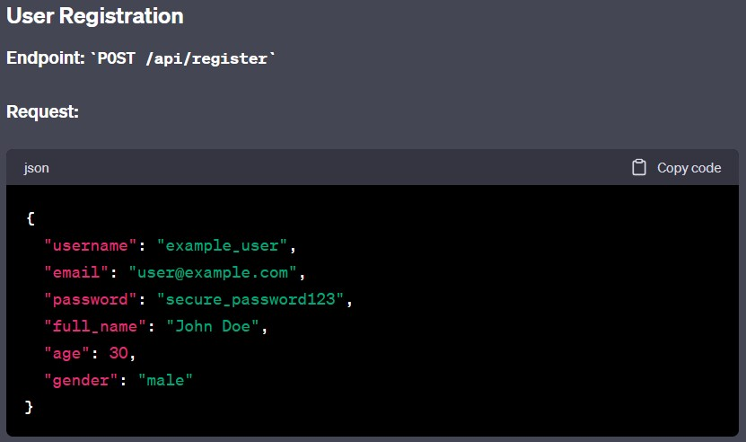
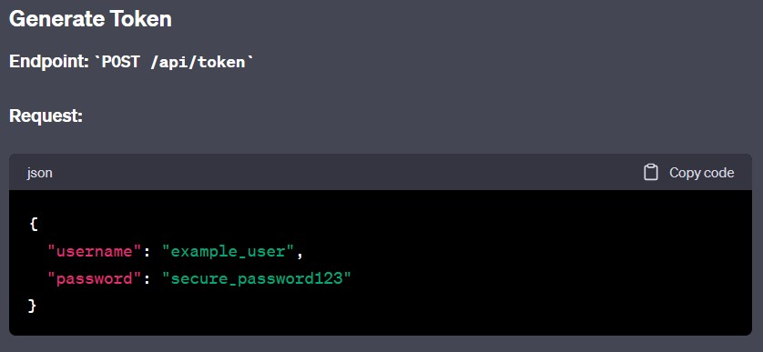
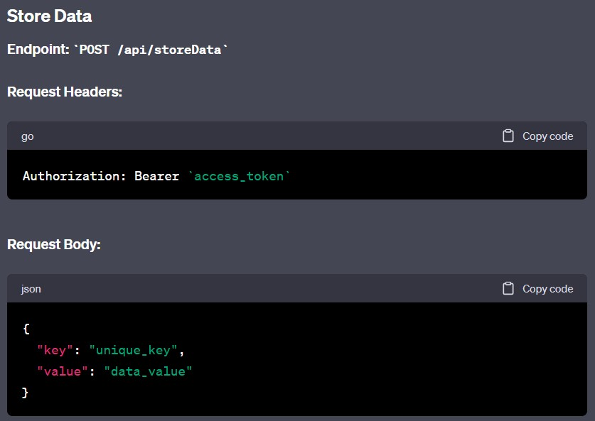
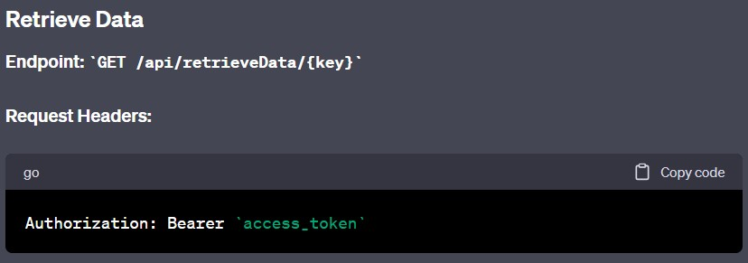
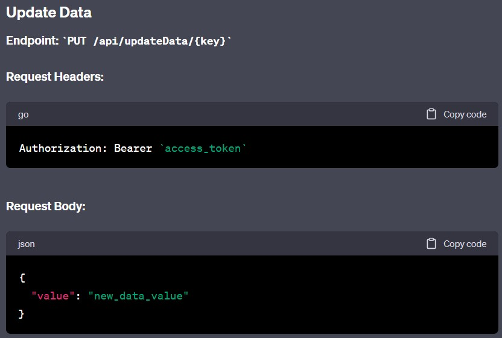
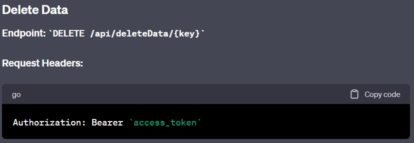

# Backend Server

This project implements a robust backend server that allows user registration and performs CRUD operations on data with user authentication. It leverages the following frameworks to enhance its functionality:

1. **Express.js**: Utilized to create a well-structured codebase, making it easier to manage routes and middleware.

2. **Cors**: Enabled to permit access to the server from different URLs, ensuring better compatibility with various clients.

3. **dotenv**: Implemented to securely store and manage sensitive information, such as database credentials.

4. **bcrypt**: Employed for encrypting user passwords, guaranteeing data privacy and security.

5. **jsonwebtoken**: Used to generate and manage user authentication tokens, enabling secure user sessions.

6. **sequelize**: Integrated to interact efficiently with the MySQL database, reducing the need for complex SQL queries. SQL databases are chosen for stricter entity relationships.

## Table of Contents

- [Installation and Run Guide](#installation-and-run-guide)
- [Project Use Guide](#project-use-guide)
- [Deployed Link](#deployed-link)

## Installation and Run Guide

1. Create a `.env` file in the root directory of the project.

2. Specify the following environment variables in the `.env` file:

   ```env
   DATABASE_NAME=Server
   DATABASE_USER=root
   DATABASE_PASSWORD=your_database_password
   DATABASE_HOST=localhost
   JWT_SECRET=your_jwt_secret
   PORT=3000

3. npm install

4. npm start

## Project Use Guide








## Deployed Link
The backend server is deployed at: https://dpd-zero-backend.onrender.com


